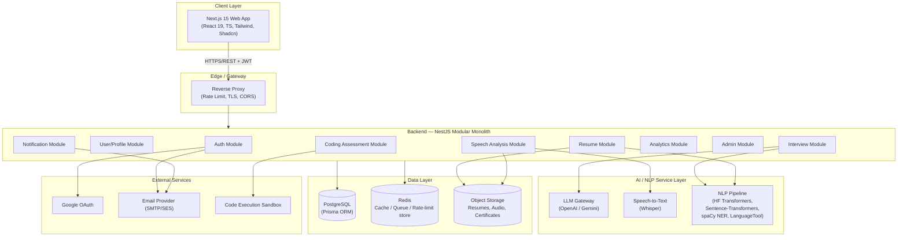
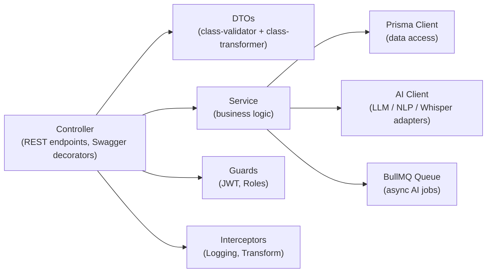
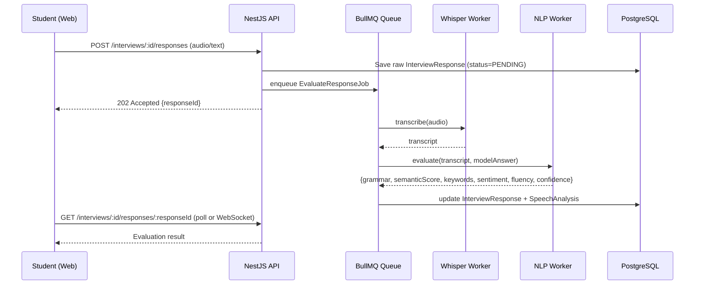
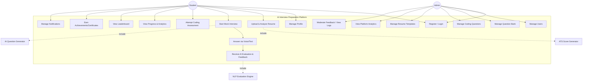

# AI Interview Preparation & Evaluation Platform
## Phase 1 — Software Requirements Specification & System Design

**Document Version:** 1.0
**Project Type:** Final Year Major Project (7th Semester)
**Architecture Style:** Modular Monolith (NestJS) + Decoupled Frontend (Next.js) + AI Service Layer

---

## Table of Contents

1. Software Requirements Specification (SRS)
2. System Architecture
3. Use Case Diagram
4. Entity Relationship (ER) Diagram
5. Database Design (Full Schema)
6. Folder Structure
7. API Design
8. UI Wireframes
9. Technology Justification

---

# 1. Software Requirements Specification (SRS)

## 1.1 Purpose

The AI Interview Preparation & Evaluation Platform is a web application that enables students to practice technical, HR, behavioral, and coding interviews with an AI interviewer, receive automated evaluation of their spoken/written answers (grammar, semantic similarity, keyword matching, sentiment, fluency, pronunciation), analyze and improve their resumes against ATS criteria, and track their improvement over time through analytics, achievements, and leaderboards. Admins manage the content (questions, categories, coding problems, resume templates) and monitor platform-wide analytics.

## 1.2 Scope

The system supports two roles — **Student** and **Admin** — across six interview domains (Software Development, Data Science, AI/ML, Cloud Computing, Cybersecurity, HR). It is delivered as a responsive web application (Next.js frontend, NestJS backend, PostgreSQL database) with an integrated AI/NLP layer (LLM-based question generation & evaluation, Whisper speech-to-text, Hugging Face/Sentence-Transformer based semantic scoring).

## 1.3 Functional Requirements

### FR-1 Authentication & Account Management
- FR-1.1 Register with email/password (bcrypt-hashed), with email verification via OTP.
- FR-1.2 Login with email/password issuing short-lived JWT access token + long-lived rotating refresh token (httpOnly cookie).
- FR-1.3 Google OAuth 2.0 login/registration.
- FR-1.4 Forgot password flow via OTP-based reset.
- FR-1.5 Role-based access control (Student, Admin) enforced via guards.

### FR-2 Profile & Resume
- FR-2.1 Manage profile (name, avatar, target role, experience level, skills).
- FR-2.2 Upload resume (PDF), parsed into structured data (skills, experience, education, projects).
- FR-2.3 Generate ATS score with sub-scores (formatting, keyword density, skills match, section completeness).
- FR-2.4 Detect missing skills relative to a target job role and recommend resources.
- FR-2.5 AI-generated resume improvement suggestions (bullet rewrites, missing sections, quantification).

### FR-3 Mock Interview Engine
- FR-3.1 Student selects domain, sub-topic, difficulty, and interview type (Technical/HR/Behavioral/Coding/Voice).
- FR-3.2 AI generates a question set dynamically (LLM) or from the curated question bank, adapting difficulty based on prior performance.
- FR-3.3 Student answers via text or voice (audio recorded, transcribed via Whisper).
- FR-3.4 Each answer is evaluated by the NLP pipeline: grammar correction, keyword matching, semantic similarity to model answer, sentiment/tone, and (for voice) fluency, pronunciation, filler-word count, speaking speed, pause detection, confidence score.
- FR-3.5 System computes a per-question score and an aggregated interview score with category-wise breakdown (Communication, Technical Accuracy, Confidence, Fluency).
- FR-3.6 AI generates qualitative feedback and a prioritized improvement plan at the end of the interview.
- FR-3.7 Full interview session (questions, transcripts, audio refs, scores) stored in interview history; bookmarkable.

### FR-4 Coding Assessment
- FR-4.1 Student attempts coding questions filtered by domain/difficulty/language.
- FR-4.2 In-browser code editor with syntax highlighting and language selection.
- FR-4.3 Submission executed against hidden/visible test cases; pass/fail + runtime returned.
- FR-4.4 Coding score contributes to the overall domain progress.

### FR-5 Progress, Gamification & Notifications
- FR-5.1 Dashboard with progress graphs (score trend, weak areas, domain-wise radar chart).
- FR-5.2 Achievements/badges unlocked on milestones; downloadable certificates on domain mastery.
- FR-5.3 Global and domain-wise leaderboard.
- FR-5.4 In-app + email notifications (interview reminders, achievement unlocked, admin announcements).
- FR-5.5 Dark/light theme toggle, persisted per user.

### FR-6 Admin Management
- FR-6.1 CRUD for users (view/suspend/delete), interview categories, questions, coding questions, skills taxonomy, resume templates, notifications.
- FR-6.2 Platform analytics dashboard (DAU/MAU, average scores by domain, most-attempted questions, resume ATS trends).
- FR-6.3 Feedback moderation and system logs viewer.

## 1.4 Non-Functional Requirements

| Category | Requirement |
|---|---|
| Performance | API p95 response time < 400ms excluding AI inference; AI evaluation < 6s per answer |
| Scalability | Stateless NestJS instances behind a load balancer; horizontally scalable |
| Availability | 99.5% uptime target; graceful degradation if AI provider is unreachable (queued retry) |
| Security | JWT + refresh rotation, bcrypt (cost 12), Helmet, CORS allow-list, rate limiting (100 req/15min/IP on public routes, stricter on auth routes), input validation via Zod/class-validator, parameterized queries via Prisma (SQL-injection safe), output encoding/CSP (XSS safe) |
| Usability | WCAG 2.1 AA color contrast, responsive from 320px to 4K, skeleton loaders for all async views |
| Maintainability | Modular NestJS domain modules, typed DTOs, OpenAPI/Swagger auto-generated docs |
| Portability | Fully Dockerized; deployable to Railway (backend + DB) and Vercel (frontend) |
| Data Privacy | Resumes and audio stored in object storage with signed URLs; PII encrypted at rest where applicable |

## 1.5 Assumptions & Constraints

- AI provider (OpenAI/Gemini) API key required; Whisper can run via OpenAI API or a self-hosted faster-whisper container.
- PostgreSQL is the system of record; audio/resume binary files are stored in object storage (S3-compatible) with only references in the DB.
- Coding assessment execution uses a sandboxed runner (e.g., Judge0-compatible) — treated as an external service boundary.

---

# 2. System Architecture

## 2.1 High-Level Architecture (C4 — Container View)



## 2.2 Layered Backend Architecture (per module)



## 2.3 Request Flow — Mock Interview Answer Evaluation (Sequence)



## 2.4 Architectural Decisions

| Decision | Rationale |
|---|---|
| Modular monolith over microservices | Faster to build/deploy for a major project scope; module boundaries (Auth, Resume, Interview, Speech, Coding, Admin) keep code decoupled while avoiding distributed-systems overhead |
| Async job queue (BullMQ + Redis) for AI evaluation | AI inference (LLM + Whisper + NLP) can take seconds; queueing avoids blocking the request thread and enables retries |
| Prisma ORM | Type-safe queries, migrations, and schema-as-code shared between the API and Prisma Studio for admin data inspection |
| Object storage for binary assets | Keeps PostgreSQL lean; resumes/audio are large and better served via signed URLs from S3-compatible storage |
| Next.js App Router | Server components for fast initial dashboard loads, client components for interactive interview/recording UI |

---

# 3. Use Case Diagram



---

# 4. Entity Relationship (ER) Diagram

```mermaid
erDiagram
    USERS ||--o| PROFILES : has
    USERS ||--o{ RESUMES : uploads
    USERS ||--o{ MOCK_INTERVIEWS : attempts
    USERS ||--o{ PROGRESS : tracks
    USERS ||--o{ ACHIEVEMENTS : earns
    USERS ||--o{ CERTIFICATES : receives
    USERS ||--o{ NOTIFICATIONS : receives
    USERS ||--o{ FEEDBACK : submits
    USERS ||--o{ OTP : requests
    USERS ||--o{ REFRESH_TOKENS : issued
    USERS ||--o{ LEADERBOARD : ranked_in
    USERS }o--|| ROLES : assigned

    RESUMES ||--o| RESUME_ANALYSIS : analyzed_as
    RESUME_ANALYSIS ||--o| ATS_REPORTS : produces

    INTERVIEW_CATEGORIES ||--o{ QUESTIONS : contains
    INTERVIEW_CATEGORIES ||--o{ MOCK_INTERVIEWS : categorizes
    INTERVIEW_CATEGORIES ||--o{ CODING_QUESTIONS : contains

    MOCK_INTERVIEWS ||--o{ INTERVIEW_RESPONSES : contains
    QUESTIONS ||--o{ INTERVIEW_RESPONSES : answered_in
    INTERVIEW_RESPONSES ||--o| SPEECH_ANALYSIS : analyzed_by

    SKILLS }o--o{ RESUMES : matched_against
    SKILLS }o--o{ PROFILES : possessed_by

    USERS {
        uuid id PK
        string email
        string passwordHash
        string googleId
        boolean emailVerified
        datetime createdAt
    }
    ROLES {
        uuid id PK
        string name
    }
    PROFILES {
        uuid id PK
        uuid userId FK
        string fullName
        string avatarUrl
        string targetRole
        string experienceLevel
    }
    RESUMES {
        uuid id PK
        uuid userId FK
        string fileUrl
        json parsedData
        datetime uploadedAt
    }
    SKILLS {
        uuid id PK
        string name
        string category
    }
    INTERVIEW_CATEGORIES {
        uuid id PK
        string name
        string description
    }
    QUESTIONS {
        uuid id PK
        uuid categoryId FK
        string type
        string difficulty
        text questionText
        text modelAnswer
        json keywords
    }
    CODING_QUESTIONS {
        uuid id PK
        uuid categoryId FK
        string title
        text description
        string difficulty
        json testCases
        json supportedLanguages
    }
    MOCK_INTERVIEWS {
        uuid id PK
        uuid userId FK
        uuid categoryId FK
        string type
        string difficulty
        string status
        int overallScore
        datetime startedAt
        datetime completedAt
    }
    INTERVIEW_RESPONSES {
        uuid id PK
        uuid interviewId FK
        uuid questionId FK
        text transcript
        string audioUrl
        int score
        json evaluationBreakdown
    }
    SPEECH_ANALYSIS {
        uuid id PK
        uuid responseId FK
        float pronunciationScore
        float fluencyScore
        float confidenceScore
        int speakingSpeedWpm
        int fillerWordCount
        int pauseCount
    }
    RESUME_ANALYSIS {
        uuid id PK
        uuid resumeId FK
        json missingSkills
        json suggestions
        string targetJobRole
    }
    ATS_REPORTS {
        uuid id PK
        uuid analysisId FK
        int atsScore
        json sectionScores
    }
    PROGRESS {
        uuid id PK
        uuid userId FK
        uuid categoryId FK
        int totalInterviews
        float averageScore
        json trend
    }
    ACHIEVEMENTS {
        uuid id PK
        uuid userId FK
        string badgeCode
        datetime earnedAt
    }
    CERTIFICATES {
        uuid id PK
        uuid userId FK
        uuid categoryId FK
        string fileUrl
        datetime issuedAt
    }
    LEADERBOARD {
        uuid id PK
        uuid userId FK
        uuid categoryId FK
        int rank
        int score
        string period
    }
    NOTIFICATIONS {
        uuid id PK
        uuid userId FK
        string title
        text message
        boolean isRead
        datetime createdAt
    }
    FEEDBACK {
        uuid id PK
        uuid userId FK
        string subject
        text message
        string status
    }
    OTP {
        uuid id PK
        uuid userId FK
        string code
        string purpose
        datetime expiresAt
    }
    REFRESH_TOKENS {
        uuid id PK
        uuid userId FK
        string tokenHash
        datetime expiresAt
        boolean revoked
    }
    SETTINGS {
        uuid id PK
        string key
        string value
    }
```



---

# 5. Database Design (Full Schema Reference)

> Prisma-authoritative schema is generated in Phase 3. This table is the design-time contract.

### 5.1 Core Identity

| Table | Key Columns | Notes |
|---|---|---|
| `Users` | id, email (unique), passwordHash (nullable for OAuth), googleId, emailVerified, isActive, roleId FK, createdAt, updatedAt | Soft-delete via `isActive` |
| `Roles` | id, name (STUDENT/ADMIN) | Seeded |
| `Profiles` | id, userId FK (1:1), fullName, avatarUrl, targetRole, experienceLevel, bio | |
| `OTP` | id, userId FK, code (hashed), purpose (VERIFY_EMAIL/RESET_PASSWORD), expiresAt, consumedAt | 6-digit, 10 min expiry |
| `RefreshTokens` | id, userId FK, tokenHash, userAgent, expiresAt, revoked | Rotation on every refresh |

### 5.2 Resume Domain

| Table | Key Columns | Notes |
|---|---|---|
| `Resumes` | id, userId FK, fileUrl, originalName, parsedData (JSON), uploadedAt | Parsed via resume-parser AI module |
| `Skills` | id, name, category | Many-to-many with Profiles & Resumes |
| `ResumeAnalysis` | id, resumeId FK, missingSkills (JSON), suggestions (JSON), targetJobRole | |
| `ATSReports` | id, analysisId FK, atsScore, sectionScores (JSON: formatting, keywords, structure) | |

### 5.3 Interview Domain

| Table | Key Columns | Notes |
|---|---|---|
| `InterviewCategories` | id, name, description, icon | Software Dev, Data Science, AI/ML, Cloud, Cybersecurity, HR |
| `Questions` | id, categoryId FK, type (TECHNICAL/HR/BEHAVIORAL), difficulty, questionText, modelAnswer, keywords (JSON) | |
| `CodingQuestions` | id, categoryId FK, title, description, difficulty, testCases (JSON), supportedLanguages (JSON) | |
| `MockInterviews` | id, userId FK, categoryId FK, type, difficulty, status (IN_PROGRESS/COMPLETED), overallScore, startedAt, completedAt | |
| `InterviewResponses` | id, interviewId FK, questionId FK, transcript, audioUrl, score, evaluationBreakdown (JSON) | |
| `SpeechAnalysis` | id, responseId FK (1:1), pronunciationScore, fluencyScore, confidenceScore, speakingSpeedWpm, fillerWordCount, pauseCount | |

### 5.4 Progress & Gamification

| Table | Key Columns | Notes |
|---|---|---|
| `Progress` | id, userId FK, categoryId FK, totalInterviews, averageScore, trend (JSON time-series) | |
| `Achievements` | id, userId FK, badgeCode, earnedAt | |
| `Certificates` | id, userId FK, categoryId FK, fileUrl, issuedAt | |
| `Leaderboard` | id, userId FK, categoryId FK, rank, score, period (WEEKLY/MONTHLY/ALL_TIME) | |

### 5.5 Platform

| Table | Key Columns | Notes |
|---|---|---|
| `Notifications` | id, userId FK, title, message, isRead, createdAt | |
| `Feedback` | id, userId FK, subject, message, status (OPEN/RESOLVED) | |
| `Settings` | id, key (unique), value | Global platform config (feature flags, thresholds) |

---

# 6. Folder Structure

```
ai-interview-platform/
├── frontend/
│   ├── app/
│   │   ├── (auth)/
│   │   │   ├── login/page.tsx
│   │   │   ├── register/page.tsx
│   │   │   ├── forgot-password/page.tsx
│   │   │   └── verify-otp/page.tsx
│   │   ├── (student)/
│   │   │   ├── dashboard/page.tsx
│   │   │   ├── profile/page.tsx
│   │   │   ├── resume/page.tsx
│   │   │   ├── interview/
│   │   │   │   ├── setup/page.tsx
│   │   │   │   ├── session/[id]/page.tsx
│   │   │   │   └── result/[id]/page.tsx
│   │   │   ├── coding/
│   │   │   │   ├── page.tsx
│   │   │   │   └── [id]/page.tsx
│   │   │   ├── history/page.tsx
│   │   │   ├── leaderboard/page.tsx
│   │   │   ├── achievements/page.tsx
│   │   │   └── notifications/page.tsx
│   │   ├── (admin)/
│   │   │   ├── dashboard/page.tsx
│   │   │   ├── users/page.tsx
│   │   │   ├── categories/page.tsx
│   │   │   ├── questions/page.tsx
│   │   │   ├── coding-questions/page.tsx
│   │   │   ├── resume-templates/page.tsx
│   │   │   ├── analytics/page.tsx
│   │   │   └── logs/page.tsx
│   │   ├── layout.tsx
│   │   └── globals.css
│   ├── components/
│   │   ├── ui/                 # shadcn primitives
│   │   ├── charts/
│   │   ├── interview/
│   │   ├── resume/
│   │   ├── coding/
│   │   └── shared/
│   ├── hooks/
│   ├── services/                # API clients (axios + TanStack Query)
│   ├── store/                   # zustand stores
│   ├── lib/                     # zod schemas, utils
│   ├── types/
│   ├── public/assets/
│   ├── tests/                   # Playwright e2e
│   ├── middleware.ts
│   ├── next.config.ts
│   ├── tailwind.config.ts
│   └── package.json
│
├── backend/
│   ├── src/
│   │   ├── auth/
│   │   │   ├── controllers/
│   │   │   ├── services/
│   │   │   ├── dto/
│   │   │   ├── guards/
│   │   │   ├── strategies/       # jwt.strategy.ts, google.strategy.ts
│   │   │   └── auth.module.ts
│   │   ├── users/
│   │   ├── resume/
│   │   │   ├── ai/                # parser.service.ts, ats.service.ts
│   │   ├── interview/
│   │   │   ├── ai/                # question-generator.service.ts, evaluator.service.ts
│   │   ├── speech/
│   │   │   ├── ai/                # whisper.service.ts, pronunciation.service.ts
│   │   ├── coding/
│   │   │   ├── judge/             # sandbox-runner client
│   │   ├── analytics/
│   │   ├── achievements/
│   │   ├── certificates/
│   │   ├── leaderboard/
│   │   ├── notifications/
│   │   ├── admin/
│   │   ├── common/
│   │   │   ├── decorators/
│   │   │   ├── filters/
│   │   │   ├── interceptors/
│   │   │   ├── middlewares/
│   │   │   └── pipes/
│   │   ├── config/
│   │   ├── queue/                 # BullMQ processors
│   │   ├── prisma/
│   │   │   └── prisma.service.ts
│   │   ├── app.module.ts
│   │   └── main.ts
│   ├── test/                      # Jest unit + e2e
│   ├── Dockerfile
│   └── package.json
│
├── prisma/
│   ├── schema.prisma
│   ├── seed.ts
│   └── migrations/
│
├── docker/
│   ├── docker-compose.yml
│   ├── frontend.Dockerfile
│   ├── backend.Dockerfile
│   └── nginx/nginx.conf
│
├── docs/
│   ├── PHASE-1-Architecture-and-Design.md
│   ├── api-reference/ (Swagger export)
│   └── diagrams/
│
├── .env.example
├── .gitignore
└── README.md
```

---

# 7. API Design

Base URL: `/api/v1` · Auth: `Bearer <JWT>` unless marked public · All responses follow `{ success, data, message }` envelope · Full interactive docs served at `/api/docs` (Swagger).

### 7.1 Authentication — `/auth`
| Method | Endpoint | Access | Description |
|---|---|---|---|
| POST | `/auth/register` | Public | Register with email/password |
| POST | `/auth/login` | Public | Email/password login → access + refresh token |
| POST | `/auth/google` | Public | Google OAuth code exchange |
| POST | `/auth/refresh` | Public (refresh cookie) | Rotate access token |
| POST | `/auth/logout` | Student/Admin | Revoke refresh token |
| POST | `/auth/verify-otp` | Public | Verify email via OTP |
| POST | `/auth/resend-otp` | Public | Resend OTP |
| POST | `/auth/forgot-password` | Public | Send reset OTP |
| POST | `/auth/reset-password` | Public | Reset password with OTP |

### 7.2 Users & Profile — `/users`
| Method | Endpoint | Access |
|---|---|---|
| GET | `/users/me` | Student/Admin |
| PATCH | `/users/me` | Student/Admin |
| PATCH | `/users/me/profile` | Student/Admin |
| DELETE | `/users/me` | Student/Admin |

### 7.3 Resume — `/resume`
| Method | Endpoint | Access |
|---|---|---|
| POST | `/resume/upload` | Student |
| GET | `/resume` | Student |
| GET | `/resume/:id/analysis` | Student |
| POST | `/resume/:id/analyze` | Student — triggers ATS + suggestions pipeline |
| GET | `/resume/:id/ats-report` | Student |
| DELETE | `/resume/:id` | Student |

### 7.4 Interview — `/interviews`
| Method | Endpoint | Access |
|---|---|---|
| GET | `/interviews/categories` | Student |
| POST | `/interviews` | Student — create session (domain, difficulty, type) |
| GET | `/interviews/:id/questions` | Student — AI-generated or bank questions |
| POST | `/interviews/:id/responses` | Student — submit answer (text/audio) |
| GET | `/interviews/:id/responses/:responseId` | Student — poll evaluation result |
| POST | `/interviews/:id/complete` | Student — finalize, compute overall score + feedback |
| GET | `/interviews` | Student — history |
| GET | `/interviews/:id` | Student |
| PATCH | `/interviews/:id/bookmark` | Student |

### 7.5 Speech Analysis — `/speech`
| Method | Endpoint | Access |
|---|---|---|
| POST | `/speech/transcribe` | Student — Whisper STT |
| GET | `/speech/analysis/:responseId` | Student |

### 7.6 Coding Assessment — `/coding`
| Method | Endpoint | Access |
|---|---|---|
| GET | `/coding/questions` | Student |
| GET | `/coding/questions/:id` | Student |
| POST | `/coding/questions/:id/submit` | Student — run against test cases |
| GET | `/coding/submissions` | Student |

### 7.7 Analytics — `/analytics`
| Method | Endpoint | Access |
|---|---|---|
| GET | `/analytics/progress` | Student |
| GET | `/analytics/overview` | Admin — platform-wide KPIs |
| GET | `/analytics/domain/:categoryId` | Admin |

### 7.8 Leaderboard — `/leaderboard`
| Method | Endpoint | Access |
|---|---|---|
| GET | `/leaderboard` | Student/Admin — `?categoryId&period` |

### 7.9 Achievements & Certificates — `/achievements`, `/certificates`
| Method | Endpoint | Access |
|---|---|---|
| GET | `/achievements` | Student |
| GET | `/certificates` | Student |
| POST | `/certificates/:id/download` | Student |

### 7.10 Notifications — `/notifications`
| Method | Endpoint | Access |
|---|---|---|
| GET | `/notifications` | Student/Admin |
| PATCH | `/notifications/:id/read` | Student/Admin |
| POST | `/notifications/broadcast` | Admin |

### 7.11 Admin — `/admin`
| Method | Endpoint | Access |
|---|---|---|
| GET/PATCH/DELETE | `/admin/users(/:id)` | Admin |
| GET/POST/PATCH/DELETE | `/admin/categories(/:id)` | Admin |
| GET/POST/PATCH/DELETE | `/admin/questions(/:id)` | Admin |
| GET/POST/PATCH/DELETE | `/admin/coding-questions(/:id)` | Admin |
| GET/POST/PATCH/DELETE | `/admin/skills(/:id)` | Admin |
| GET/POST/PATCH/DELETE | `/admin/resume-templates(/:id)` | Admin |
| GET | `/admin/logs` | Admin |
| GET/PATCH | `/admin/feedback(/:id)` | Admin |

---

# 8. UI Wireframes (Structural Sketches)

### 8.1 Student Dashboard
```
┌──────────────────────────────────────────────────────────────┐
│ Logo   Dashboard  Interviews  Coding  Resume  Leaderboard  🌙 👤│
├───────────┬──────────────────────────────────────────────────┤
│  Sidebar  │  Welcome back, {name}                             │
│  - Dash   │  ┌───────────┐ ┌───────────┐ ┌───────────┐        │
│  - Resume │  │ Avg Score │ │ Interviews│ │ ATS Score │        │
│  - Mock   │  │   78%     │ │    12     │ │    82     │        │
│  - Coding │  └───────────┘ └───────────┘ └───────────┘        │
│  - History│  ┌───────────────────────┐ ┌──────────────────┐   │
│  - Boards │  │  Score Trend (Chart)  │ │ Domain Radar Chart│   │
│  - Achieve│  └───────────────────────┘ └──────────────────┘   │
│  - Notif  │  Recent Interviews: [list with score badges]      │
└───────────┴──────────────────────────────────────────────────┘
```

### 8.2 Mock Interview Session
```
┌──────────────────────────────────────────────────────────────┐
│  Question 3 / 10                          ⏱ 00:45   [Bookmark]│
│  "Explain the difference between REST and GraphQL."           │
│                                                                 │
│      ┌────────────────────────────────────────────┐           │
│      │   🎙  Recording... waveform visualization    │           │
│      └────────────────────────────────────────────┘           │
│      [Text fallback input box]                                 │
│                                                                 │
│  Live cues: Filler words: 2   Pace: 132 wpm   Confidence: 74%  │
│                                     [Skip]  [Submit Answer]     │
└──────────────────────────────────────────────────────────────┘
```

### 8.3 Interview Result / Feedback
```
┌──────────────────────────────────────────────────────────────┐
│  Overall Score: 81/100          [Download Report] [Retry]     │
│  ┌─────────────┐ ┌─────────────┐ ┌─────────────┐              │
│  │ Communication│ │ Technical   │ │ Confidence  │              │
│  │    85%       │ │   78%       │ │    79%      │              │
│  └─────────────┘ └─────────────┘ └─────────────┘              │
│  Per-question breakdown (expandable):                          │
│   Q1 ▸ Score 90 — grammar: good, keywords matched: 6/8         │
│   Q2 ▸ Score 70 — semantic similarity low, missed "CAP theorem"│
│  AI Feedback: "Strengthen distributed-systems fundamentals..." │
└──────────────────────────────────────────────────────────────┘
```

### 8.4 Resume Analyzer
```
┌──────────────────────────────────────────────────────────────┐
│  Upload Resume (PDF)  [Drag & Drop / Browse]                   │
│  ─────────────────────────────────────────────                │
│  ATS Score: 74/100   ⬤⬤⬤⬤⬤⬤⬤○○○                              │
│  Missing Skills: [Docker] [Kubernetes] [System Design]         │
│  Suggestions:                                                   │
│   • Quantify impact in Project #2 (add metrics)                │
│   • Add a "Certifications" section                              │
│  [Regenerate Suggestions]  [Download Improved Resume]           │
└──────────────────────────────────────────────────────────────┘
```

### 8.5 Admin Dashboard
```
┌──────────────────────────────────────────────────────────────┐
│  Admin Sidebar: Users | Categories | Questions | Coding |      │
│                 Resume Templates | Analytics | Logs | Feedback │
├──────────────────────────────────────────────────────────────┤
│  KPI Cards: Total Users | Active Today | Interviews Today |    │
│             Avg Platform Score                                 │
│  Charts: Signups over time | Domain popularity | Score dist.   │
│  Data tables: Recent users, Recent feedback (with actions)     │
└──────────────────────────────────────────────────────────────┘
```

---

# 9. Technology Justification

| Layer | Choice | Why (vs. alternatives) |
|---|---|---|
| Frontend framework | Next.js 15 (App Router) + React 19 | SSR/SEO for public pages, React Server Components reduce client JS for dashboards, built-in routing/middleware for auth guards — lighter than a separate SPA + BFF |
| Styling | Tailwind CSS + Shadcn UI | Utility-first speed of iteration + accessible, unstyled Radix-based primitives that stay fully customizable (vs. heavier component libraries like MUI that fight custom theming) |
| Forms/validation | React Hook Form + Zod | Minimal re-renders, shared schema validation reusable on backend DTOs' logic shape |
| Server state | TanStack Query | Caching, retries, background refetch for polling AI evaluation jobs — better fit than manual `useEffect` fetching |
| Client state | Zustand | Lightweight global state (theme, active interview session) without Redux boilerplate |
| Backend framework | NestJS | Opinionated modular architecture (modules/controllers/providers), first-class DI, native Swagger + guard/interceptor pipeline — better structured for a large multi-module system than Express alone |
| ORM | Prisma | Type-safe queries, migration tooling, and a single schema source of truth across 20+ related tables |
| Database | PostgreSQL | Strong relational integrity for interview/resume/user relationships, JSONB support for flexible AI evaluation payloads |
| Auth | JWT + refresh rotation + Google OAuth | Stateless scaling of the API; refresh rotation limits token replay; OAuth reduces registration friction |
| AI/LLM | OpenAI/Gemini (pluggable gateway) | Best-in-class reasoning for question generation & qualitative feedback; abstracted behind an interface so the provider is swappable |
| Speech-to-text | Whisper | High accuracy across accents, open weights available for self-hosting to control cost/latency |
| NLP pipeline | Hugging Face Transformers + Sentence-Transformers | Sentence-Transformers give fast, cheap semantic-similarity scoring without an LLM call per answer; HF models cover sentiment/NER/grammar as swappable local models to reduce API cost |
| Async processing | BullMQ + Redis | AI evaluation is latency-heavy; queueing decouples submission from evaluation and enables retries/backoff |
| Testing | Jest + Playwright | Jest for unit/integration (NestJS default), Playwright for realistic cross-browser e2e of interview flows |
| Deployment | Docker Compose (local/staging), Railway (backend+DB), Vercel (frontend) | Vercel is the reference host for Next.js edge/SSR features; Railway gives simple managed Postgres + container deploys for the API without managing raw infra |

---

## Phase 1 Deliverable Summary

Completed in this phase:
- Full SRS with functional and non-functional requirements
- C4-style container architecture, layered module architecture, and sequence diagram for the core AI evaluation flow
- Use case diagram covering both roles
- Complete ER diagram spanning all 21 core tables
- Table-by-table database design reference
- Full monorepo folder structure (frontend, backend, prisma, docker, docs)
- Complete REST API surface (all 12 modules) with methods, routes, and access levels
- Structural wireframes for the five key screens
- Technology justification for every stack choice

This document is the binding design contract for all subsequent phases — Phase 2 (Backend Initialization) will scaffold the NestJS project exactly against the module list and folder structure defined in Sections 6 and 7.

**Waiting for your message: "Continue to Phase 2"**
